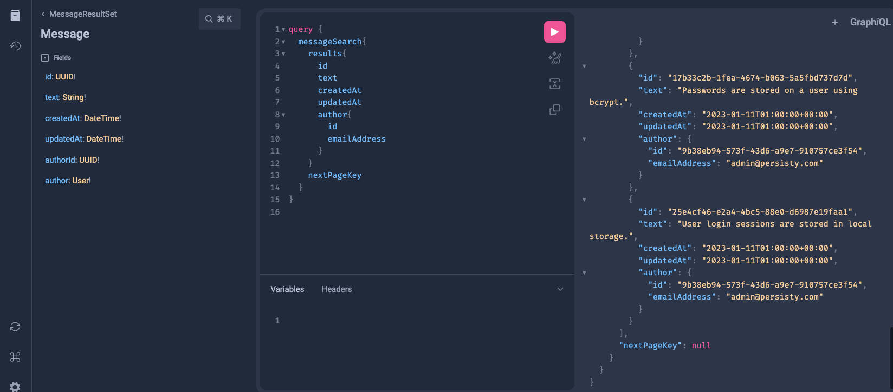

# Persisty Example App : Messager : Part 1

This example application allows CRUD / Search / Batch Edit operations on
user and message objects. It sets up the basic entities and project structure, but not
the security constraints (Which are handled in Part 2) or the Html / 
Javascript client side code (Which is handled in Part 3)

## Running the Code

* Clone the git repo `git clone https://github.com/tofarr/persisty.git`
* Go to the directory `cd persisty/examples/messager_1`
* Create a virtual environment. (I used [virtualenvwrapper](https://virtualenvwrapper.readthedocs.io/en/latest/)
  for this)
  * `pip install virtualenvwrapper`
  * `mkvirtualenv messager_1`
  * `workon messager_1`
* Install requirements with `pip install -r requirments.txt`
* Run the project `python -m main`

## What is Going On Here...

* Created a [main.py](main.py) to run the project locally (Which also includes
  dotenv and loads environment variables from [.env](.env))
* `SERVEY_MAIN` is set to [messager/](messager). This is the primary module for
  the project.
* We define 2 stored entity types. They auto generate ids and timestamps, with
  constraints on attributes and relations:
  * [User](messager/store/user.py)
  * [Message](messager/store/message.py)
* `add_actions_for_all_stores` is called from [the actions module](messager/actions/__init__.py)
  These will be used to provide CRUD, search, and batch edit operations externally via
  REST / GraphQL.
* We add some seed data for testing in seeds:
  * [user_seeds](seeds/user.json)
  * [message_seeds](seeds/message.json)
  
## Viewing the result

Run the project locally in a hosted mode using `python -m main`. This will start a 
[starlette server](https://www.starlette.io/), and load the seed data into memory backed stores, which are not
actually persistant, and will reset after a server restart.

* View the OpenAPI REST API on [http://localhost:8000/docs](http://localhost:8000/docs)
  
* View the GraphQL API on [http://localhost:8000/graphiql/](http://localhost:8000/graphiql/)
  
  ```
  query {
	messageSearch{
    results{
      item{
        id
        messageText
        createdAt
        updatedAt
		    author{
          id
          emailAddress
        }
      }
    }
    nextPageKey
    }
  }
  ```

## Summary

We have created 2 related entities with external access via REST and GraphQL, but there are no restrictions
on access to them. In [the next step](../messager_2), we will add security and integrity constraints.

