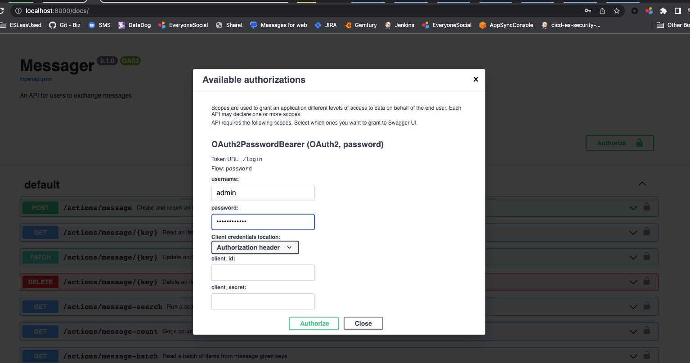
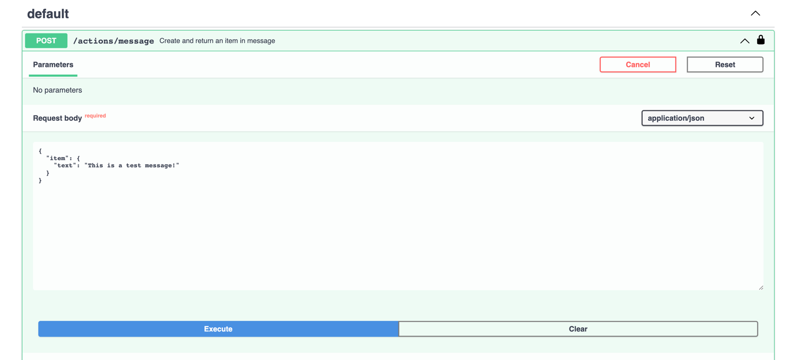
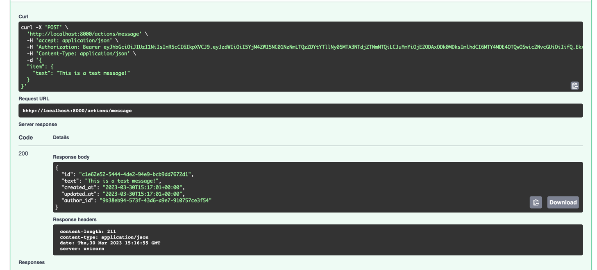
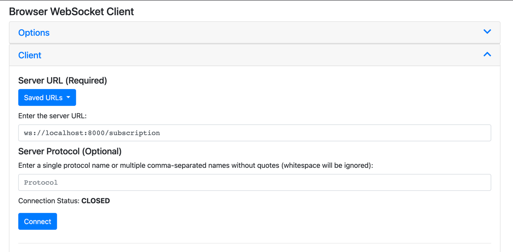
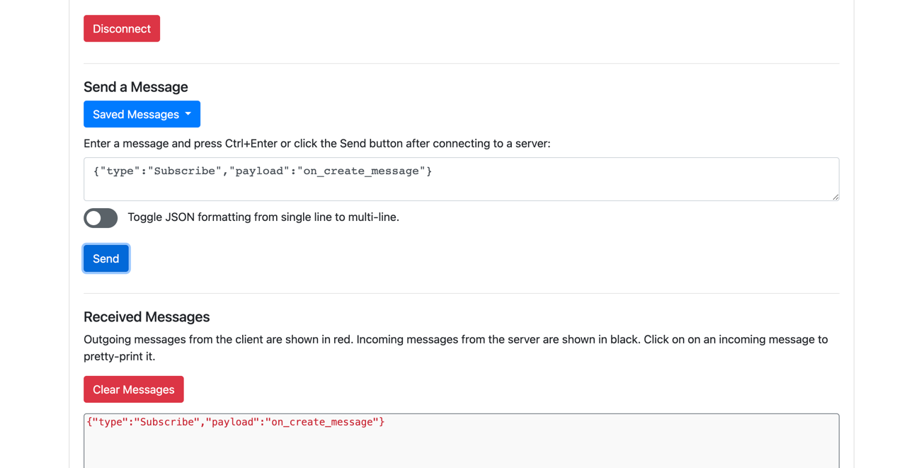
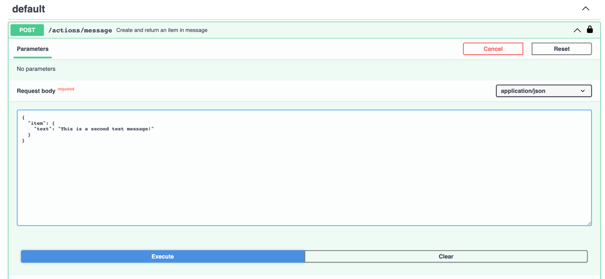
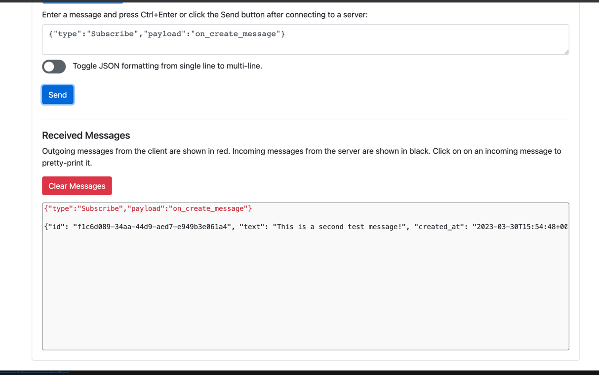

# Persisty Example App : Messager : Part 2

In [the previous step](../messager_1), we added basic item schemas and constraints.
This example, builds upon that to secure the storage. Storage secured separately to
the resource definitions, as we consider it to be a separate process conceptually.

## Running the Code

* Clone the git repo `git clone https://github.com/tofarr/persisty.git`
* Go to the directory `cd persisty/examples/messager_2`
* Create a virtual environment. (I used [virtualenvwrapper](https://virtualenvwrapper.readthedocs.io/en/latest/)
  for this)
  * `pip install virtualenvwrapper`
  * `mkvirtualenv messager_2`
  * `workon messager_2`
* Install requirements with `pip install -r requirments.txt`
* Run the project `python -m main`

## What is Going On Here...

* The store factories have been updated to constrain the available operations / attributes based upon
  the user making the request:
  * [user_store_factory.py](messager/store/user_store_factory.py): Most applications have a level of custom business
    logic related to users, and this is no exception. The important thing here is not so much the logic, but that store
    factories represent an insertion point at which you can add whatever logic you need.
  * [message_store_factory.py](messager/store/message_store_factory.py): Ownership of messages is now enforced.
* A custom [UserAuthenticator](messager/user_authenticator.py) was [registered](marshy_config_main/__init__.py) to
  control login using your user items.
* Custom actions for [login and signup](messager/actions/auth.py) were added.
* A subscription was added for [publishing messages to connected browsers](messager/subscriptions.py) using websockets,
  along with an [action that is triggered when new messages are created](messager/actions/on_create_message.py)
  
## Viewing the result

* Run the project locally in a hosted mode using `python -m main`. This will start a 
  [starlette server](https://www.starlette.io/) on [http://localhost:8000/docs](http://localhost:8000/docs)

* This time you will need to log in to create a message. Use the user defined in the seed data - 
  `admin` / `Password123!` You will get an error if you try to create a message
  without logging in! 
  
* You can view published websocket events in the browser. I use the [Browser Websocket Client Chrome Extension](https://chrome.google.com/webstore/detail/browser-websocket-client/mdmlhchldhfnfnkfmljgeinlffmdgkjo?hl=en)
  for this:
  * Connect the websocket client  `ws://localhost:8000/subscription`
  * Subscribe to on_create_message  
    Send `{"type":"Subscribe","payload":"on_create_message"}`
  * Create a second mesage 
    `{
      "item": {
        "text": "This is a second test message!"
      }
    }`
  * Note the message that was received over websocket 

## Summary

We now have an API which has 2 secured entities, and produces an event which browsers can subscribe to.
[In the next step, we'll add a basic UI for our application](../messager_3).
