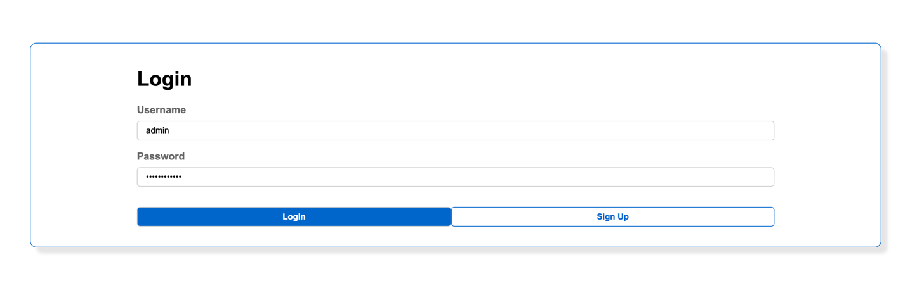
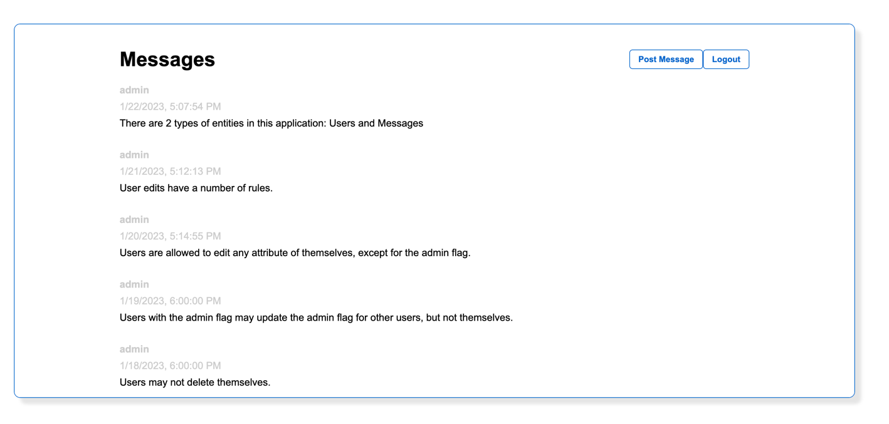

# Persisty Example App : Messager : Part 3

In [the previous step](../messager_5), user SQL as our persistence mechanism.
In this example we will deploy to AWS: Lambdas are used for actions, SQS for 
subscriptions, KMS for Keys, and Dynamodb will be used for persistence.

Effectively this means the same application code can be used in test environments,
hosted environments, and AWS environments.

## Running the Code

* Clone the git repo `git clone https://github.com/tofarr/persisty.git`
* Go to the directory `cd persisty/examples/messager_5`
* Create a virtual environment. (I used [virtualenvwrapper](https://virtualenvwrapper.readthedocs.io/en/latest/)
  for this)
  * `pip install virtualenvwrapper`
  * `mkvirtualenv messager_5`
  * `workon messager_5`
* Install requirements with `pip install -r requirments.txt`
* Generate serverless yml definitions with `python -m servey sls`

## What is Going On Here...

* 

We added a `static_site` directory to serve html / css / js / images on 
[https://localhost:8000](https://localhost:8000). This doesn't use any framework, but the
accessibility of the UI (GraphQL or REST with OpenAPI) should make it compatible with
many client side frameworks.

* Login with `admin` / `Password123!` 
* The Main UI should allow viewing and posting messages 

## Summary

We now have an API with a UI which may be viewed in browsers. It still doesn't actually
persist data, nor is it deployed anywhere outside of a local enviroment - in the 
[next step we will cover using SQLAlchemy and Alembic to connect to a SQL database](../messager_4),
suitable for hosted enviroments. Alternativey, the [step after that does not user SQL
but instead uses DynamoDB and lambda to deploy to AWS Cloud using Serverless](../messager_5).