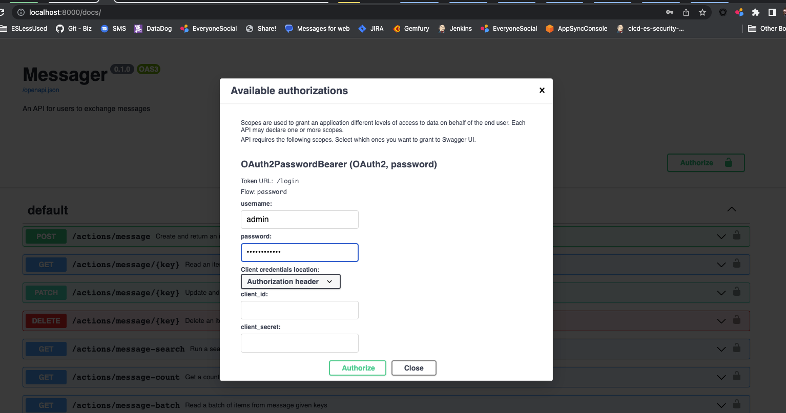
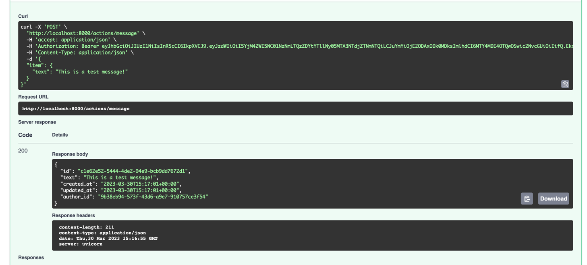
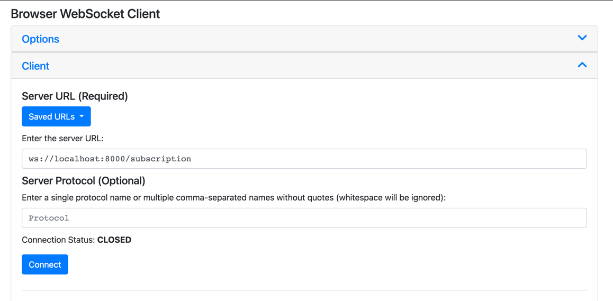
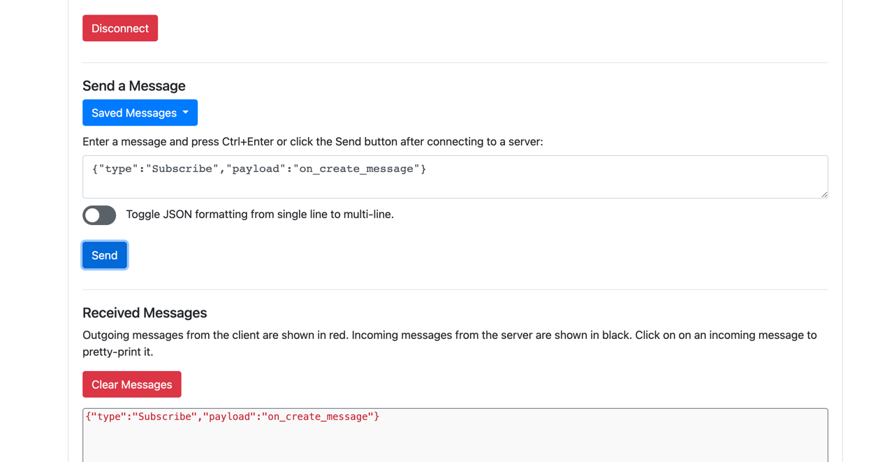
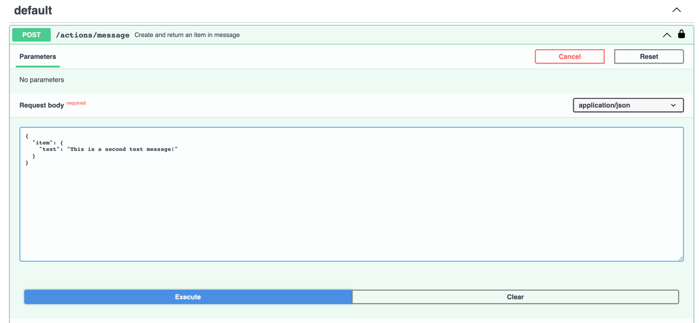
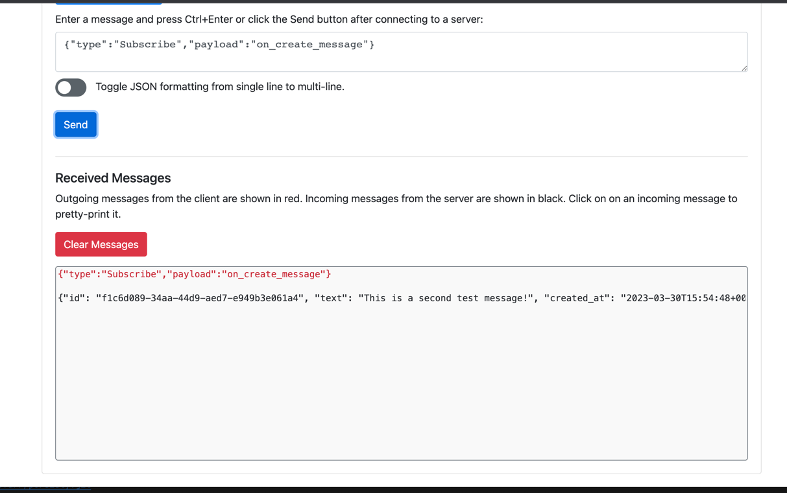

# Persisty Example App : messenger : Part 2

In [the previous step](../messenger_1), we added basic item schemas and constraints.
This example, builds upon that to secure the storage.

## Running the Code

* Clone the git repo `git clone https://github.com/tofarr/persisty.git`
* Go to the directory `cd persisty/examples/messenger_2`
* Create a virtual environment. (I used [virtualenvwrapper](https://virtualenvwrapper.readthedocs.io/en/latest/)
  for this)
  * `pip install virtualenvwrapper`
  * `mkvirtualenv messenger_2`
  * `workon messenger_2`
* Install requirements with `pip install -r requirments.txt`
* Run the project `python -m main`

## What is Going On Here...

* The store definitions have been updated to constrain the available operations / attributes based upon
  the user making the request:
  * [user.py](messenger/store/user.py): Most applications have a level of custom business logic related
    to users, and this is no exception - we use a custom [store_security](messenger/store/user_store_security.py)
    which provides different access rules for admins to regular users. It also makes sure that password
    digests are not exported through the api.
  * [message.py](messenger/store/message.py): Ownership of messages is now enforced.
* A custom [UserAuthenticator](messenger/user_authenticator.py) was [registered](marshy_config_main/__init__.py) to
  control login using your user items.
* Custom actions for [login and signup](messenger/actions/auth.py) were added.
* An event channel was added for [publishing messages to connected browsers](messenger/event_channels.py) using websockets,
  along with an [action that is triggered when new messages are created](messenger/actions/on_create_message.py)
  
## Viewing the result

* Run the project locally in a hosted mode using `python -m main`. This will start a 
  [starlette server](https://www.starlette.io/) on [http://localhost:8000/docs](http://localhost:8000/docs)

* This time you will need to log in to create a message. Use the user defined in the seed data - 
  `admin` / `Password123!` You will get an error if you try to create a message
  without logging in! 

* Most requests in GraphIQL now require that you set an authorization header: `{"Authorization": "Bearer ...`
  You can get a value for this header by running the login mutation
  
* You can view published websocket events in the browser. I use the [Browser Websocket Client Chrome Extension](https://chrome.google.com/webstore/detail/browser-websocket-client/mdmlhchldhfnfnkfmljgeinlffmdgkjo?hl=en)
  for this:
  * Connect the websocket client  `ws://localhost:8000/subscription`
  * Subscribe to on_create_message  
    Send `{"type":"Subscribe","payload":"on_create_message"}`
  * Create a second mesage 
    `{
      "item": {
        "message_text": "This is a second test message!"
      }
    }`
  * Note the message that was received over websocket 

## Summary

We now have an API which has 2 secured entities, and produces an event which browsers can subscribe to.
[In the next step, we'll add a basic UI for our application](../messenger_3).
